# 05 · 法学课堂笔记结构调研

> 目的：回答"一份好的法学课堂笔记应该长什么样"，并给出可以直接照着改 `packages/notes` 的结构设计。
> 上游事实依据：`docs/04-笔记流水线现状.md`（15 节点/课、逐段独立撰写、机械拼装、终审）。
> 本文所有带 `[E#]` 的结论均可在 §7 出处表查到链接与要点；标 `未找到可靠证据` 的地方就是真的没找到，不要当成省略。

---

## 一、结论先行

### 1.1 一句话结论

**笔记应该按"知识体系"组织，但必须保留"讲授时间"作为可追溯的坐标；两者不是二选一，而是分别由「程序」和「模型」负责的两条轴。**

当前"割裂"的根因不是分段多，而是**每个节点在写作时不知道自己在这门课的知识体系里处于什么位置**——它看到的只有自己那 120 行转录、上一节点末尾 1600 字、下一节点的标题。三样东西里没有一样能让它写出"这一节是为了解决第二节遗留的问题"这种句子。

### 1.2 五个功能层，与对应的结构部件

一份笔记对复习者只提供五种价值。**每个部分必须能对应到其中至少一层，否则就是元话语，应删。**

| 层 | 作用 | 对应部件 | 谁生成 | 必选 |
|---|---|---|---|---|
| L1 定向 | 让读者 30 秒内知道这节课在讲什么、要回答什么 | 开篇「这节课在讲什么」+ 全课知识地图 | 模型（结构由程序给） | 必选 |
| L2 内容 | 规则、要件、案例、学说、论证过程的完整呈现 | 各知识模块正文 | 模型 | 必选 |
| L3 关系 | 让孤立的知识点互相咬合——跨节概念线、辨析表、承上启下 | 跨节概念线 + 辨析表 + 章节导语 | 程序定位 + 模型成文 | 必选 |
| L4 检索 | 复习时快速定位（"这条法条在哪讲过"） | 法条/案例/术语索引表 + 时间轴对照表 | 程序 | 必选 |
| L5 自测 | 主动检索，检验"以为会了" | 节末自测 + 折叠答案 | 模型 | 必选 |

**明确不在其中**：节点级小结、写作目标对照、待补写标记、自报评分、全课总结（与开篇概览重复）。见 §5 反面清单。

### 1.3 结构总览（两套模板共用骨架，差异在中段）

```
# [课程名] · 第 N 课 —— [本课主题]                     ← 一句话标题，不带"笔记"二字
> [日期/节次/时长] · [本课使用的 PPT 页码]              ← 元信息，2 行以内

## 一、这节课在讲什么                                     ← L1，300–500 字，必选
   ├─ 主线陈述（3–5 句）
   ├─ 全课知识地图（Mermaid，节点 ≤ 12）                 ← 可选但强烈建议
   ├─ 本课要回答的问题（3–5 个 Why/How/区别类）           ← 必选；此处只列问题，不给答案
   └─ 学完你应该能（3–5 条可验证动词开头）                ← 可选

## 二～N、[一级知识模块]（5–8 个）                        ← L2，每节 800–2500 字，必选
   ├─ 章节导语（1–2 句，说清本节与前一节的关系）          ← L3，必选
   ├─ 规则/方法正文（要件拆解 / 方法卡）                  ← L2
   ├─ 案例 / 数据 / 论文（带"在本课论证中的功能"）         ← L2
   ├─ 老师的立场与理由                                    ← L2
   ├─ 争点对照表 / 辨析表                                 ← L3
   └─ 本节自测 3–5 题 + 折叠答案                          ← L5

## N+1、跨节概念线                                       ← L3，必选
## N+2、索引（法条 / 案例 / 易混 / 术语与 ASR 更正）      ← L4，程序生成，必选
## 附录 A：时间轴 ↔ 体系对照表                           ← L4，程序生成，必选
## 附录 B：课堂发散（折叠）                               ← 可选
## 附录 C：笔记元数据 META（折叠）                        ← 已有，保留
```

**顺序的理由**：定向在前（先行组织者只有放在学习之前才有效 `[E8]`）→ 内容 → 关系 → 检索 → 自测分散在各节末尾（节后问题对相关内容有正向效果，节前事实性问题对无关内容有负向效果 `[E6]`）→ 索引与对照表垫底（它们是工具，不是读物）。

---

## 二、证据基础：先说清楚"凭什么"

证据分三级，**本项目的建议若只用 C 级证据支撑，我会明说**。

| 级别 | 含义 | 例子 |
|---|---|---|
| A | 元分析 / 大样本实验，效应量明确 | Dunlosky 2013、Bertsch 2007、Hamaker 1986、Nesbit & Adesope 2006 |
| B | 法学教育领域的实证调查或权威机构规范 | Cooper & Gurung 2018、Columbia 写作中心 IRAC 手册 |
| C | 行业通行做法 / 教学经验总结（法学院指导页、法考机构） | JD Advising、Barbri、中国政法大学法考学院 |

### 2.1 与本设计直接相关的九条结论

| # | 结论 | 出处 | 对本项目的含义 |
|---|---|---|---|
| 1 | 检索练习与分散练习被评为"高效用"；精细提问、自我解释、交错练习为"中等效用"；**摘要、划线、重读为"低效用"** | `[E1]` Dunlosky et al. 2013 | 笔记里必须有自测题；不能只靠"划重点+重读"。**这条同时判了"层末小结"的死刑**——摘要式内容对学生收益最低 |
| 2 | 自己生成的信息比读到的信息记得更牢，86 项研究平均 d≈0.40；且**保持间隔越长、材料越难，生成效应越大** | `[E2]` Bertsch et al. 2007 | 自测题的价值随复习周期拉长而上升。对期末复习场景，生成 > 阅读 |
| 3 | 概念图/知识地图与知识保持提升相关，效应量由小到大不等，取决于怎么用 | `[E3]` Nesbit & Adesope 2006 | 知识地图值得做，但**"怎么用"决定收益**——只贴一张图不如把图当作复习时的自述提纲 |
| 4 | 康奈尔笔记法：提示栏（关键词/问题）+ 笔记栏 + 总结栏，提示栏用于遮住笔记栏自测 | `[E4]` Cornell LSC | 直接支持"节末自测"而非"节末小结"。但见下条 |
| 5 | 康奈尔法的实证证据**并不一致**：有研究发现笔记质量更好但成绩无显著差异 | `[E4b]` Wikipedia 综述 | 不要把它当"已被证明有效"来卖。它的价值在于**结构可操作**，不在于强证据 |
| 6 | 法学领域自己的数据：能向同学解释困惑概念（r=.36/.32）、用练习题学习（r=.30/.27）与法科 GPA 正相关；**因没练习而写不出规则（r=−.40/−.27）**、不会组织论述题答案（r=−.29/−.23）、"我的大纲太长"（r=−.26/−.29）与 GPA 负相关 | `[E5]` Cooper & Gurung 2018 | ① 自测必须包含**"自己写出规则"**这种主动产出，而不是只有选择判断；② **笔记过长本身是负相关信号**，需要压缩版 |
| 7 | 附加问题（adjunct questions）：**节后问题**对相关内容有正向效果（重复题 .16、相关题 .07）；**节前事实性问题对无关内容有负向效果（−.05）**；高阶问题比事实性问题有更普遍的促进效果 | `[E6]` Hamaker 1986 | 自测题放**节末**，不放节首；题型用 Why/How/辨析/应用，不用"X 的定义是什么" |
| 8 | 文本连贯性对**低知识读者**帮助更大；但存在"反向连贯效应"——高知识读者有时从低连贯文本中获益更多（被迫生成推论） | `[E9]` McNamara 等 | 承上启下衔接段要写给"第一次学这门课的人"；但对已掌握的部分不必反复解释，否则浪费篇幅 |
| 9 | 多媒体学习中："连贯原则"（排除无关材料学得更深）、"信号原则"、"冗余原则" | `[E10]` Mayer | 课堂发散内容必须隔离到附录；图表不要复述正文文字；标题层级要起到信号作用 |

### 2.2 明确没有找到可靠证据的三件事

1. **"法科笔记结构"的随机对照实验**。Cooper & Gurung 是问卷相关性研究，不是干预实验；法学院指导页（JD Advising / Barbri）是经验总结。**没有任何研究直接比较过"按时间顺序的笔记"与"按体系重排的笔记"的学习效果**——本项目的重排方案只能靠机制推理（生成效应、连贯性、检索定位成本）来论证，不能声称有实验支持。
2. **笔记里自测题的"最优数量"**。Hamaker 明确指出问题密度是效应量的调节变量，但没有给出可照搬的最优值 `[E6]`。本文给的数量是工程约束下的建议，不是实证结论。
3. **北大/清华/人大法学院官方发布的"笔记方法"文件**。检索到的是教学沙龙、课程改革、论文写作等新闻稿（如张骐《数字时代的法学教育目标和方法》），**未找到其中关于学生笔记组织的可引用规范**。`未找到可靠证据`

### 2.3 一条必须澄清的常见误传

"手写笔记比打字更有效"——Mueller & Oppenheimer (2014) 的结论**未能被直接复制**。Urry et al. (2021) 的复制研究未发现手写优势，若干复制研究的小型元分析显示效应可忽略 `[E11]`。
**含义**：不要用"手写更好"来论证任何关于笔记形式的设计；本项目全程是数字笔记，无需为此做任何补偿性设计。

---

## 三、结构模板（可直接实现）

### 3.1 通用字段与渲染契约

先定义程序要产出的东西，再谈正文——因为**结构必须由程序保证，模型只填空**。

```jsonc
// LessonBlueprint v2（在现有 outline 基础上扩展）
{
  "lessonKey": "business-law-2026-04-15-3-4",
  "courseKind": "doctrinal",          // doctrinal | empirical  ← 决定用哪套模板
  "transcriptLineCount": 1320,
  "mainLine": "本课围绕公司资本制度展开，先讲资本三原则的规范功能，再讲认缴制下的责任分配。",
  "sections": [                        // ← 一级节，按【笔记最终展示顺序】排列
    {
      "sectionId": "S1",
      "order": 1,
      "title": "一、资本三原则及其规范功能",
      "role": "建立本课的概念底座，后文所有争论都以此为坐标",   // 在本课论证中的功能
      "parts": [                       // ← 时间顺序的原始讲授片段（可多段合并）
        { "nodeId": "N01", "lineRange": [1, 260],    "partRole": "原则引入" },
        { "nodeId": "N07", "lineRange": [1180, 1290], "partRole": "老师回头补充的例外" }
      ],
      "dependsOn": [],                 // 依赖哪些节先讲
      "concepts": ["资本确定原则", "资本维持原则"],
      "provisions": ["公司法第26条"],
      "cases": ["某案"],
      "emphasis": 3,                   // ★ 等级 1–3
      "quiz": true,                    // 是否出题（信息量过小的过渡节可 false）
      "wordBudget": 1800               // 本节目标字数
    }
  ],
  "appendix": [ { "topic": "调课通知", "lineRange": [1300, 1320] } ],
  "threads": [                         // ← 跨节概念线
    { "concept": "资本维持原则",
      "occurrences": [
        { "sectionId": "S1", "lineRange": [80, 140],   "role": "定义" },
        { "sectionId": "S3", "lineRange": [700, 760],  "role": "与抽逃出资的关系" }
      ] }
  ]
}
```

**硬不变量（程序校验，不满足就退回，不放行）**：

| 不变量 | 校验函数（建议位置） | 意义 |
|---|---|---|
| 所有 `parts[].lineRange` 的并集 = `[1, transcriptLineCount]`，且两两不重叠 | `assertSectionCoverage()`（扩展 `node-lifecycle.mjs:assertOutlineCoverage`） | 重排**不得**导致漏讲 |
| 每个 `parts[].nodeId` 必须存在于原大纲 | `assertNoInventedNodes()` | 防模型编造内容块 |
| 每个原 `nodeId` 至少出现一次 | `assertNoDroppedNodes()` | 防模型丢内容 |
| `sectionId` 唯一、`order` 连续 | `assertSectionShape()` | 渲染的前提 |
| 单个 `node` 不得被拆到两个 section | `assertNoNodeSplit()` | 防止模型把一段连续讲授切碎 |

### 3.2 法教义学课程模板

适用：商法概论、国际刑法学、普通法专题、刑事执行法。

**核心骨架是"规则—要件—适用—争点"**。依据：Columbia 写作中心明确要求规则段应"综合并解释"从案例中提炼的规则，而不是罗列案例，且规则段如漏斗——先一般后例外、先宪法法律后判例 `[E14]`；JD Advising 的 outlining 指南同样要求把规则拆成可管理的要件、案例只用 1–2 句写规则而非案情 `[E15]`。

````markdown
# 商法概论 · 第 7 课 —— 公司资本制度

> 2026-04-15 第 3–4 节，约 105 分钟 · 使用课件：`商法-07-资本制度.pptx`（第 3–28 页）

## 一、这节课在讲什么

本课要解决一个具体问题：2013 年认缴制改革之后，"资本三原则"还是规范吗？老师的回答
是——原则的**功能**从"事前门槛"转为"事后责任分配的解释工具"，因此认缴制没有废除它们，
只是改变了它们的适用方式。

（以下为 3–5 句主线陈述，说明本课从哪个问题出发、经过哪几步、落到什么结论。）

### 全课知识地图

```mermaid
flowchart TD
  A["公司资本制度"] --> B["资本三原则"]
  A --> C["认缴制下的责任"]
  B --> B1["确定原则"]
  B --> B2["维持原则"]
  B --> B3["不变原则"]
  C --> C1["出资加速到期"]
  C --> C2["抽逃出资"]
  B2 -.解释工具.-> C2
```



### 本课要回答的问题

1. 认缴制改革之后，资本三原则还剩什么规范功能？
2. "资本维持"与"抽逃出资"是什么关系——同一个规则的两个名字，还是两条独立路径？
3. 出资加速到期在解释论上有哪几种方案，老师倾向哪一种，为什么？

### 学完你应该能

- 复述资本三原则各自约束的对象与手段
- 用要件式方法判断一个行为是否构成抽逃出资
- 说明认缴制改革对三原则功能的改变及其解释论后果

---

## 二、资本三原则及其规范功能

（导语，1–2 句，必须写"关系"而非"顺序"）
> 三原则不是三条并列的口号，而是分别约束**设立时**、**存续中**、**变更时**三个不同环节，
> 这一点决定了后文讨论"认缴制废除了哪些"时不能笼统回答。

### （一）资本确定原则

**规则陈述**：公司在设立时必须在章程中确定资本总额，并由股东认足。

**要件拆解**
1. **章程记载**——判断标准：章程是否载明注册资本数额
2. **股东认足**——判断标准：认缴协议是否覆盖全部注册资本

**案例**
| 案例 | 争点 | 裁判要旨 | 在本课论证中的功能 |
|---|---|---|---|
| ×× 案 | 章程未载明数额时公司是否成立 | …… | 用来说明"确定原则"在设立阶段的硬约束，为下文对比其存续阶段的软化做铺垫 |

**老师的立场与理由**
> 老师强调：确定原则在今天主要是一道**登记法上的形式要求**，它约束的是登记机关而不是股东。

### （二）资本维持原则
（同上结构）

### 争点对照

| 争点 | A 说 | B 说 | 通说 | 老师的倾向 |
|---|---|---|---|---|
| 抽逃出资是否以"损害债权人"为要件 | …… | …… | …… | 倾向 B，理由是…… |

### 本节自测

**1. 用要件式方法说明：股东在认缴期届满前将已缴出资转出，是否构成抽逃出资？**

<details><summary>参考答案</summary>

（答案正文）

</details>

**2. 资本维持原则约束的是谁——股东、公司还是债权人？为什么这个问题在认缴制下变得重要？**

<details><summary>参考答案</summary>
…
</details>

---

## 三、认缴制下的责任分配
（同上）

---

## 八、跨节概念线

### 资本维持原则

| 出现位置 | 讲法 | 侧重点 | 与前后出现的关系 |
|---|---|---|---|
| §二（二） | "公司存续期间应维持与其资本额相当的财产" | 定义与功能 | — |
| §三（一） | 再次出现，用于解释加速到期的正当性 | 作为**解释工具**而非独立规则 | 从"约束股东的规则"变为"支持债权人请求的论证资源" |

**跨节综合**：老师在本课中把资本维持原则当了两次不同的东西用——第一次是规则，第二次是理由。
这个转变正是本课主线。

## 九、索引

### 法条索引

| 法条 | 一句话内容 | 在本课解决什么问题 | 出现位置 |
|---|---|---|---|
| 公司法第 26 条 | …… | 确定原则的规范依据 | §二（一） |

### 案例索引
| 案例 | 争点 | 要旨（≤2 句） | 在本课论证中的功能 |
|---|---|---|---|

### 易混辨析
| A | B | 区别维度 | 判断标准 | 典型例子 |
|---|---|---|---|---|

### 术语与 ASR 更正
| 转写原文 | 正确术语 | 依据 |
|---|---|---|
| 资本充实 | 资本维持 | 课件第 9 页 |

## 附录 A：时间轴 ↔ 体系对照

| 原讲授时间 | 转录行 | 内容 | 在笔记中的位置 |
|---|---|---|---|
| 00:00–00:22 | L1–260 | 资本三原则 | §二 |
| 00:22–01:05 | L261–760 | 认缴制改革 | §三（一） |
| 01:38–01:48 | L1180–1290 | 老师回头补充的例外 | **§二（一）**（已前移） |

## 附录 B：课堂发散
<details><summary>展开</summary>…</details>

## 附录 C：笔记元数据
<!-- 保留现有 renderMetaBlock 输出 -->
````

### 3.3 实证 / 方法论课程模板

适用：法律实证分析、犯罪学。

**核心骨架是"研究问题—识别难题—方法—数据—结论—局限"**，与法教义学模板的差别不是换几个标题，而是**知识单元的性质不同**：教义学的知识单元是"规则"，实证课程的知识单元是"方法 + 一次具体的研究实例"。因此：

- 教义学笔记里"案例"是规则的例证；实证笔记里"论文/数据"本身就是被学习的对象，必须完整记录设计细节。
- 教义学笔记的核心复述能力是"写出规则"；实证笔记的核心复述能力是"判断一个研究设计能否回答它声称的问题"。
- 图表类型不同：教义学用流程图/关系图；实证用**因果图（DAG）**、识别策略示意、样本与时间结构图。

````markdown
# 法律实证分析 · 第 5 课 —— 双重差分与政策评估

> 2026-04-15 · 使用课件：`实证-05-DID.pptx`（第 1–34 页）

## 一、这节课在讲什么

本课要解决一个方法论难题：当我们只有一个政策在某一时点、某一地区实施时，
凭什么说观察到的变化是政策造成的？老师的路线是——先讲清"反事实"为什么不可观测，
再引入 DID 用两组两期差分逼近它，最后用课堂数据演示平行趋势假设检验失败的后果。

### 本课的论证链


### 本课要回答的问题

1. 为什么"政策前后对比"不能回答因果问题？差掉了什么、没差掉什么？
2. 平行趋势假设在什么意义上不可检验？实践中用什么替代？
3. 如果处理组与对照组的事前趋势不同，DID 估计量的偏误方向是什么？

---

## 二、核心概念

| 概念 | 定义 | 为什么需要它 | 常见误解 |
|---|---|---|---|
| 反事实 | …… | 因果推断的定义性对象 | 误以为"对照组"就是反事实 |
| 平行趋势 | …… | DID 的识别假设 | 误以为可以用事后数据检验事前趋势 |

## 三、方法卡：双重差分（DID）

### 解决什么问题
估计一个在特定时点、特定群体实施的政策对结果变量的平均处理效应。

### 核心识别假设
平行趋势：若无政策，处理组与对照组的结果变量变化趋势相同。**这是不可直接检验的反事实假设。**

### 数据要求
- 面板数据或重复截面，至少两组两期
- 处理组与对照组在政策前有可比的事前趋势（可用事件研究图作**间接**证据）

### 估计量
$$\hat{\tau} = (\bar{Y}_{T,post} - \bar{Y}_{T,pre}) - (\bar{Y}_{C,post} - \bar{Y}_{C,pre})$$

### 常见误用
1. 把"事前趋势不显著"当成假设成立的证明——不显著可能只是检验功效不足
2. 处理组选择内生时，平行趋势天然不成立
3. 交错处理（staggered adoption）下使用双向固定效应，会产生负权重问题

### 课堂实例
| 论文/数据 | 处理与对照 | 结果变量 | 老师对它的评价 |
|---|---|---|---|

### 操作要点（可选）
```stata
* 事件研究图
reghdfe y i.rel_time, absorb(id year) cluster(id)
```

## 四、课堂讨论的研究与数据
（每篇：研究问题 / 识别策略 / 数据 / 结论 / 老师指出的问题）

## 五、可复用清单
- **数据源**：……
- **检查清单**：做 DID 前必须回答的 6 个问题
- **延伸阅读**：老师提到的文献

## 六、本节自测

**1. 某研究用"政策实施前后两年"比较处理省与对照省，发现处理省结果变量上升更多，据此声称政策有效。
请指出至少两个可能让这个结论失效的原因。**

<details><summary>参考答案</summary>
…
</details>

**2. 如果平行趋势假设不成立，且处理组在政策前本就在上升，DID 估计量会偏高还是偏低？为什么？**

<details><summary>参考答案</summary>
…
</details>

## 七、索引
（同教义学模板：术语表、论文索引、方法索引、ASR 更正）
````

### 3.4 两套模板差异对照

| 维度 | 法教义学 | 实证 / 方法论 |
|---|---|---|
| 一级节的组织轴 | 规范对象（主体/行为/责任）+ 争点 | 研究流程（问题 → 识别 → 方法 → 证据 → 局限） |
| 核心知识单元 | 规则 + 要件 + 案例 | 方法 + 研究实例 |
| 必含表格 | 要件清单、争点对照、法条索引、案例索引 | 概念定义表、方法卡、常见误用表、论文索引 |
| 推荐图类型 | 知识地图（flowchart）、规则关系图 | 因果图 DAG、识别策略示意、论证链 |
| 自测题主力题型 | 要件应用、辨析、写规则 | 设计判断、偏误方向、替代解释 |
| 易混点来源 | 学说分歧、构成要件边界 | 方法前提、估计量性质 |
| 附录内容 | 课堂发散、术语 | 数据源、代码片段、延伸文献 |

### 3.5 篇幅预算（必选 / 可选标注）

以 **2 小时课、约 4.5 万字转录**为基准（与仓库实测一致）：

| 部件 | 篇幅 | 必选 | 生成方 |
|---|---|---|---|
| 标题 + 元信息 | ≤ 60 字 | 必选 | 程序 |
| 「这节课在讲什么」主线 | 150–300 字 | 必选 | 模型 |
| 全课知识地图 | Mermaid 6–12 节点 | 可选（建议做） | 程序给骨架 + 模型写关系词 |
| 本课要回答的问题 | 3–5 题，每題 1 句 | 必选 | 模型 |
| 学完你应该能 | 3–5 条 | 可选 | 模型 |
| 一级知识模块 | **5–8 个**，每个 800–2500 字 | 必选 | 模型 |
| 其中章节导语 | 每节 40–80 字 | 必选 | 模型 |
| 每节自测 | 3–5 题 + 答案 | 必选 | 模型 |
| 跨节概念线 | 每个跨节概念 1 表，3–6 行 | 必选（有跨节概念时） | 程序定位 + 模型成文 |
| 索引表 | 每表 5–25 行 | 必选 | 程序 + 模型 |
| 附录 A 时间轴对照 | 与一级节数同量级 | 必选 | **程序** |
| 附录 B 发散 | 0–500 字，折叠 | 可选 | 模型 |
| **正文合计** | **8000–14000 字** | — | — |

**为什么要给上限**：Cooper & Gurung 的法学样本中，"我的大纲太长"与 GPA 负相关（r=−.26 / −.29），"很难压缩，因为似乎都重要"同样负相关（r=−.28）`[E5]`。超过 15000 字的单课笔记对复习者而言是负债。
**配套建议**：同一份 blueprint 允许渲染两个版本——`notes`（完整版）与 `notes-cram`（背诵版：只保留规则陈述、要件、辨析表、自测题，正文压缩到 3000–4000 字）。法考机构的分层逻辑（精讲卷搭体系 → 真题卷练解题 → 背诵卷浓缩考点）正是这个思路的行业版本 `[E18]`（C 级证据，仅作实践参照）。

### 3.6 切片规则（对应"最多 2–3 段"）

**切片单位必须是 `section`，不是字节。**

| 规则 | 说明 |
|---|---|
| R1 | 一级节数 ≤ 3 → **不切**，整课一次撰写 |
| R2 | 一级节数 > 3 → 相邻节合并为 **2–3 个 writing batch**，每个 batch ≤ 25000 字转录 |
| R3 | batch 边界必须落在 section 边界上，**不得切在 section 内部** |
| R4 | 每个 batch 的撰写输入必须包含：全课 sections 表（标题 + role 一句话）、本 batch 各节的 partRole、**相邻 batch 的首末节标题与一句话主旨**、全课共享术语表 |
| R5 | 硬上限兜底：任何 batch 转录超过 30000 字才允许在 section 内部再切，且需记录 `splitReason` |

R4 是治"割裂"最关键的一条。当前实现传的是"上一节点草稿末尾 1600 字 + 下一节点目标"——这只给了**线性邻居**，没给**体系坐标**。改为传全课结构表后，写作者才可能写出"这一节回答的正是第一节留下的问题"。

---

## 四、让笔记不再割裂：12 个低成本、可自动生成的手段

按"收益/成本"排序。每条给出：**呈现形式 / 生成方 / 易错点 / 依据**。

### M1 · 全课知识地图（开篇）

- **形式**：Mermaid `flowchart`，6–12 个节点，只放一级模块与模块间的**关系词**（如 `B2 -.解释工具.-> C2`）。同时保留一份纯文字缩进版（给不渲染 Mermaid 的阅读器和跨课整合脚本用）。
- **生成方**：程序从 `blueprint.sections` 生成节点与边（骨架）；模型只写**边上的关系词**与每个模块的一句话定位。这样模型无法虚构不存在的模块。
- **易错**：① 节点爆炸——超过 12 个节点后图就退化成又一份线性目录，不如不做；② 层级混用——把"节"和"概念"画在同一层；③ 边写成 "然后" 而不是关系（"然后"是顺序，图的价值在关系）。
- **依据**：概念图与知识保持提升相关，但效应量取决于使用方式 `[E3]`；先行组织者应与学习和保持的提升相关，且**必须在学习之前呈现** `[E8]`。**这是"地图要放开头、不要放结尾"的直接理由**——放在结尾的地图是复习材料，不是定向工具。

### M2 · 章节导语（承上启下衔接段）

- **形式**：每个一级节开头 40–80 字。**必须写关系，不能写顺序。**
  - ✗ "上一节我们讲了资本三原则，这一节我们讲认缴制下的责任分配。"
  - ✓ "三原则分别约束三个不同环节，这一点决定了：讨论认缴制改变了什么时，必须先确定问的是哪个环节。"
- **生成方**：模型（复用现有 `splicer` 角色即可，但输入要从"节点索引"升级为"`sections` 全表 + 前节 role"）。
- **易错**：① 变成"接下来我们看下一个问题"这类零信息过渡；② 每节都从零重述前文（冗余，Mayer 冗余原则 `[E10]`）；③ 捏造因果关系——模型会为了写得"顺"而编一个前后文之间并不存在的逻辑联系，**这是本手段最大的风险**，需要终审专门检查。
- **依据**：文本连贯性对低知识读者帮助更大 `[E9]`；但反向连贯效应提示对高知识读者不要过度解释 `[E9]`。因此导语写"关系"，不写"复述"。

### M3 · 跨节概念线（治割裂的主力）

- **形式**：

  | 出现位置 | 讲法 | 侧重点 | 与前后出现的关系 |
  |---|---|---|---|
  | §二（二） | 定义 | 作为规则 | — |
  | §三（一） | 再次出现 | 作为解释工具 | 从"约束股东的规则"变为"支持债权人请求的论证资源" |

  末尾附 3–5 句"跨节综合"，说明老师在本课中对同一概念的用法是否发生过**转变**。
- **生成方**：程序负责定位（扫描正文中概念名的出现位置 + 行号 + 所属小节），模型负责填"侧重点"与"关系"两列。**定位必须由程序做**——模型数位置一定会错。
- **易错**：① 同义异名导致同一概念被当成两个（需要维护别名归一表：`资本充实`/`资本维持`）；② 把"重复讲解"美化成"深化"——如果两次讲法没有实质差异，应如实写"重复"或直接合并；③ 概念过多导致表爆炸（**只追踪跨 `section` 出现的概念**，同节内多次出现不进表）。
- **依据**：这是"细切+独立撰写"的**直接解药**——当前 15 节点各自独立写作时，同一概念被反复定义或前后矛盾，终审只能事后发现。概念线把这个问题提前变成结构问题。

### M4 · 要件拆解卡（法教义学专用）

- **形式**：
  ```
  **规则**：[一句话规则陈述]
  **要件**：(1) …（判断标准：…）  (2) …（判断标准：…）
  **法律效果**：…
  **例外**：…
  ```
- **生成方**：模型。程序只校验"每条 `provisions` 至少有一个要件卡"。
- **易错**：① 把条文照抄当拆解；② 要件之间不互斥（法律上会重复评价）；③ 漏掉"法律效果"——学生能背要件但答不出后果，这正是 Cooper & Gurung 发现的"写不出规则"负相关场景 `[E5]`。
- **依据**：IRAC 的 R 段要求"综合并解释"规则而非罗列 `[E14]`；JD Advising 明确要求把规则拆成可管理的部分 `[E15]`（C 级）。

### M5 · 争点对照表 / 易混辨析表

- **形式**：
  | A | B | 区别维度 | 判断标准 | 典型例子 |
  |---|---|---|---|---|
- **生成方**：模型（现有 splicer 已产出辨析内容，需补"判断标准"与"典型例子"两列）。程序从 `META: PITFALL` 标签生成待填骨架。
- **易错**：① 制造假对立——把两个本来不冲突的概念硬写成"区别"；② 只写区别不写**判断标准**，学生看完仍不知道遇到案子怎么选；③ 维度不固定，导致表无法横向比较。
- **依据**：辨析与自我解释属"中等效用" `[E1]`；法学样本中"能向同学解释困惑概念"与 GPA 正相关 `[E5]`——辨析表正是这种解释能力的训练材料。

### M6 · 法条索引表

- **形式**：
  | 法条 | 一句话内容 | 在本课解决什么问题 | 出现位置 |
  |---|---|---|---|
- **生成方**：程序从 `META: PROVISION` + `sections[].provisions` 生成行，模型补"在本课解决什么问题"一列（这一列是程序写不出来的，也是最有价值的一列）。
- **易错**：① 条号错误（**必须与课件或转录原文核对，不得由模型推断条号**）；② 把司法解释、指导性案例、地方规定混入"法条"；③ 书名号与简称不一致导致跨课合并失败（现有规范"不带书名号、统一简称"是对的，应保持）。
- **依据**：法条是法教义学笔记的检索主键；开卷考试场景下索引质量直接等于答题速度。

### M7 · 案例索引表

- **形式**：
  | 案例 | 争点 | 裁判要旨（≤2 句） | 在本课论证中的功能 |
  |---|---|---|---|
- **生成方**：程序从 `META: CASE` 生成行；"论证意义"一列由模型写。现有 skill 已强制要求"每个案例都必须包含论证意义"，**这个约束是对的，应保留**。
- **易错**：① 论证意义写成案情复述（"这个案子说明了……"然后开始讲案情）；② 没有来源就给案例补一个"要旨"——**模型编造案例要旨是最危险的一类错误**，应要求要旨只能来自转录中老师明确表述的内容；③ 同一案例在多次课出现时名称不统一。
- **依据**：JD Advising 明确要求案例只用 1–2 句写规则、不写案情 `[E15]`；CALI 把 outlining 的实质定义为"综合"（synthesizing）而非罗列 `[E17]`。

### M8 · 时间轴 ↔ 体系对照表（重排可追溯性的载体）

- **形式**：

  | 原讲授时间 | 转录行 | 内容 | 在笔记中的位置 |
  |---|---|---|---|
  | 00:00–00:22 | L1–260 | 资本三原则 | §二 |
  | 01:38–01:48 | L1180–1290 | 老师回头补充的例外 | **§二（一）**（已前移） |

  前移/后移的条目**必须加粗标出**，让读者立刻看到"这段原本讲在后面"。
- **生成方**：**程序，100%**。时间戳来自转录元数据，行号来自 `parts[].lineRange`，笔记位置来自 `sectionId`。模型不参与。
- **易错**：① 时间戳缺失（Paraformer 的 `beginTime` 要一路带到 blueprint，现在只带行号——**这是需要补的字段**）；② 若重排后忘记标注"已前移"，读者会误以为老师是按这个顺序讲的，产生对讲授重点的错误判断。
- **依据**：本项目特有的需求，无直接文献依据；但从检索定位成本考虑，这是把"体系化"与"可追溯"同时满足的最低成本方案。`[E6]` 关于问题放置位置的结论说明：读者对信息的**位置**敏感，位置信息应当显式给出而不是让读者猜。

### M9 · 正文内交叉引用（锚点）

- **形式**：某一概念**首次系统讲解**处用 `###` 标题锚点；其他出现位置只写「参见 §二（二）」，不重复解释。
- **生成方**：程序扫描概念出现位置并插入引用（需要"哪次是首次系统讲解"的判断——可由模型给出一次性的 `threads[].occurrences[].role`，程序据此渲染）。
- **易错**：① 引用指向错误的小节；② 引用过多导致正文碎片化（**每个概念最多保留 1 处系统讲解 + 2 处引用**）；③ 锚点名称在标题改写后失效——应使用 `sectionId` 作为锚点，而不是中文标题。
- **依据**：冗余原则——同一信息重复呈现会分散注意并降低学习深度 `[E10]`。

### M10 · 术语与 ASR 更正表

- **形式**：
  | 转写原文 | 正确术语 | 依据 |
  |---|---|---|
- **生成方**：**程序 + 规则表**（现有 `asr-error-patterns.md` + 本课 PPT 用词）。这几乎是零成本的。
- **易错**：① 过度矫正（把老师确实说错的术语"修"成标准术语，掩盖了老师的真实表述）；② 无法确定时应当标注 `（转写不清，待确认）`，**不得猜测**。
- **依据**：这是**防编造的证据链**。把"我们把 X 改成了 Y，因为课件第 N 页写的是 Y"显式写出来，读者与终审都能核对。Mayer 的连贯原则不反对有信息量的元信息，反对的是无信息量的装饰 `[E10]`。

### M11 · 节末自测块（详见 §五）

- **形式**：每节 3–5 题，答案用 `<details>` 折叠。
- **生成方**：模型。
- **易错**：见 §五。

### M12 · 本课在全课程中的位置

- **形式**：`## 承前启后` —— 承接什么、为后续铺垫什么（3–5 条"本课概念 → 后续用途"）。
- **生成方**：**程序**读上一课笔记的"承前启后"段，取其中的"下节预告"作为本课"承接"的初稿；模型只补"为后续铺垫"（因为后续课还没发生，只能靠课程大纲推断）。
- **易错**：① 第一课没有前文时编造"上一节"；② 把"铺垫"写成套话（"为后续学习打下基础"）——必须具体到"§二（二）的资本维持原则将在讲抽逃出资时作为解释工具使用"。
- **依据**：现有 skill 已明确"'为后续铺垫什么'是核心，必须写"；本手段把它从单课层面升级到跨课层面。注意：**跨课整合目前在本仓库未实现**（`docs/04` §8 已列为缺口），所以 M12 的完整版依赖那个缺口被补上；单课内版本可以立即做。

### 4.1 手段汇总表

| # | 手段 | 生成方 | 程序工作量 | 模型成本 | 治"割裂"的直接程度 |
|---|---|---|---|---|---|
| M1 | 全课知识地图 | 程序骨架 + 模型关系词 | 小 | 低 | 中 |
| M2 | 章节导语（承上启下） | 模型 | 无 | 中 | **高** |
| M3 | 跨节概念线 | 程序定位 + 模型成文 | 中 | 中 | **最高** |
| M4 | 要件拆解卡 | 模型 | 无 | 中 | 中 |
| M5 | 争点/辨析表 | 模型 | 小 | 低 | 中 |
| M6 | 法条索引 | 程序 + 模型一列 | 小 | 低 | 低（但检索价值高） |
| M7 | 案例索引 | 程序 + 模型一列 | 小 | 低 | 低（但检索价值高） |
| M8 | 时间轴对照表 | **程序** | 中 | 零 | 中（可追溯性） |
| M9 | 交叉引用 | 程序 | 中 | 零 | 中 |
| M10 | 术语/ASR 表 | 程序 | 小 | 零 | 低（但防错） |
| M11 | 节末自测 | 模型 | 小 | 中 | 低（但学习价值最高） |
| M12 | 全课程位置 | 程序 + 模型 | 中 | 低 | 中 |

**如果只能做三件事**：M3（跨节概念线）、M2（章节导语写关系）、M8（时间轴对照表）。
前两个直接解决"节点之间没有呼应"，第三个让重排不损失可追溯性。

---

## 五、自测与复习：要不要、放哪里、放多少、什么题型

### 5.1 要不要自测题——要，而且这是全篇证据最强的一条

- 检索练习（practice testing）与分散练习被评为**高效用**学习技术，是 Dunlosky 综述中仅有的两项 `[E1]`。
- 法学领域自己的数据：用练习题学习与 GPA 正相关（r=.30/.27），而"因没练习而写不出规则"与 GPA 负相关（r=−.40/−.27）`[E5]`。
- 生成效应 d≈0.40，且**保持间隔越长、材料越难，收益越大** `[E2]`——期末复习场景正是长间隔 + 难材料。

**结论**：自测题是必选项，不是装饰。而且它必须包含**"自己写出规则"**这类主动产出型题目，不能只有判断题和选择题——因为负相关最强的恰恰是"没练习过写出规则" `[E5]`。

### 5.2 放在哪里——节末，不放节首

Hamaker 的元分析把附加问题分成四类（集合在前的 prequestions、插入在前的、插入在后的 postquestions、集合在后的）`[E6]`，结果是：

| 放置方式 | 对重复题 | 对相关题 | 对**无关**内容 |
|---|---|---|---|
| 节前事实性问题（prequestions） | +.15 | +.09 | **−.05（负）** |
| 节后问题（postquestions） | +.16 | +.07 | +.01 |

**节前的事实性问题会让读者把阅读变成"找答案"，从而损害对无关内容的加工** `[E6]`。因此：

- ✅ 自测题放在每个一级节**末尾**。
- ✅ 开篇「本课要回答的问题」可以保留——但它是**先行组织者**（定向工具），不是自测题，且此处**只列问题不给答案**，也不要求读者答题。这两者的机制不同，不要混为一谈 `[E8]`。
- ❌ 不要在每个节的开头放"带着这三个问题去读"式的检索题。

### 5.3 放多少题

**没有实证最优值**（Hamaker 只指出密度是效应量调节变量，未给出可照搬的最优密度 `[E6]`）。因此用工程与使用约束定：

- **每个一级节 3–5 题**（信息量小的过渡节可以 2 题或不出题）。
- **单课合计 10–20 题**。
- 依据：现有 `splicer` 提示词已规定"每章自测 2–4 题"，本建议与之接近；`final-exam-review` skill 的"每个知识点 1–6 题、密多薄少"是同类工程经验（C 级）。
- **宁少勿滥**：一道需要学生自己写出完整要件的题，价值高于五道"下列说法正确的是"。

### 5.4 什么题型最有效

按证据强度排序：

| 优先级 | 题型 | 依据 |
|---|---|---|
| ★★★ | **写出规则/要件**型（"请写出抽逃出资的构成要件，并说明每个要件的判断标准"） | 负相关最强的是"没练习写规则" `[E5]`；生成效应 `[E2]` |
| ★★★ | **Why / How / 区别**型（"资本维持原则约束的是谁？为什么这个问题在认缴制下变得重要？"） | 高阶附加问题比事实性问题有更普遍的促进效果 `[E6]`；现有 splicer 提示词已规定"核心问题应是 Why/How/区别类"，方向正确 |
| ★★☆ | **应用/假设题**（给一个事实情境，判断是否构成 X） | 法学考试的主流题型；检索练习应匹配目标测验的题型 |
| ★★☆ | **设计判断/偏误方向**型（实证课程） | 同上，匹配课程目标能力 |
| ★☆☆ | 简答题（short-answer）优于选择题 | 多项研究表明简答题式检索练习比选择题更有效；多选题还会产生"诱饵"错误记忆，需即时反馈 `[E7]` |
| ✗ | 纯定义识记题（"X 的定义是什么"） | 事实性问题促进效果窄，且可能窄化注意 `[E6]` |

### 5.5 答案怎么放

- **必选**：答案用 `<details><summary>参考答案</summary>…</details>` 折叠。
- 依据：检索的前提是**先尝试回忆再看答案**；答案紧贴题目会让读者不自觉先看答案，检索不成立 `[E1]` `[E11→见 §2.3 说明]`。
- 与仓库现有约定一致：`final-exam-review` skill 规定"普通文本输出题目在前、答案在后；HTML 输出答案默认折叠"。
- **额外要求**：参考答案里应包含**判断标准/必须出现的关键词**，而不只是结论——这样读者能自我评分。

### 5.6 复习排程（笔记之外的配套建议）

分散练习是另一项"高效用"技术 `[E1]`。Cepeda 等发现最优复习间隔随**期望保持时间**增加而增加 `[E13]`。据此：

- 若目标是期末（约 8–12 周后）：第一次复习安排在**课后 1–2 天**，第二次在 **1–2 周后**，第三次在期末前。
- 复习的载体应该是**节末自测题 + 跨节概念线 + 辨析表**，而不是重读正文——重读与划线是"低效用" `[E1]`。
- 交错练习（interleaving）有中等效用 `[E1]`，且在数学等题型辨别场景有明确收益 `[E12]`。对法学：**复习时不要按课次顺序刷，应按"争点/制度"跨课次混合**——这正好是跨节概念线（M3）与全课程整合（未实现）的用途。

---

## 六、反面清单：哪些写法会降低可读性或误导学习

每条给出**具体形态**与**为什么错**。

### 6.1 元话语类（流水线泄漏）

| 写法 | 为什么错 |
|---|---|
| 「本节点小结」「本节小结（节点 7）」 | "节点"是流水线的实现细节，不是知识单元。读者不知道"节点"是什么，也不知道该拿它干什么。而且小结本质是摘要——摘要被评为**低效用**技术 `[E1]` |
| 「写作目标对照」「本节点写作目标：……已达成」 | 完全面向流程而非读者；泄漏了 prompt 结构 |
| 「待补写」「此处待补充」「TODO」「（略）」 | 断点续跑的中间态产物。交付物里出现即视为缺陷（现有 `assembly.mjs` 已有"不得残留 `{{占位符}}`"硬校验，应把这类词一并纳入） |
| 「本课共 15 个节点」 | 同上 |
| 「覆盖率 100%」「质量分 92」 | 自报分数不稳定也不可解释——仓库已经为此删掉了五项评分，不要在笔记里以任何形式复活它 |

### 6.2 结构类

| 写法 | 为什么错 |
|---|---|
| 正文自带 `#`/`##` 与章节 `###` 并存 | 读者无法判断谁是章节。现有 `demoteBodyHeadings()` 只是**降级兜底**，正确做法是写作者根本不该产出 Markdown 标题（提示词已要求，但模型仍偶发） |
| 标题层级跳级（`###` 直接到 `#####`） | 破坏信号作用；Mayer 的信号原则要求结构提示清晰 `[E10]` |
| 一级节超过 10 个 | 结构碎片化，等价于"没结构"。建议 5–8 个；超过就说明该合并 |
| 层级与知识层级不对应（把"举例"提成标题，把"构成要件"降成列表项） | 标题层级应反映知识的逻辑层级。现有规范"标题贵精不贵多，一般要点用列表"是正确的 |
| 每个节点的标题都从零开始（"概述""基本问题""进一步讨论"） | 无信息量标题，扫描时无法定位 |

### 6.3 内容类

| 写法 | 为什么错 |
|---|---|
| 同一概念在多个小节各自完整解释一遍 | 冗余原则：重复呈现分散注意 `[E10]`。应"首次系统讲 + 其余交叉引用"（M9） |
| 承接段只写顺序不写关系（"接下来我们看……"） | 零信息过渡。连贯性需要的是关系性连接（因为/因此/与之相对/这意味着），不是顺序词 `[E9]` |
| 把课堂发散（时事评论、点名、调课、老师个人经历）混进主线 | 连贯原则：排除无关材料学得更深 `[E10]`。应进附录或直接删 |
| 案例的"论证意义"写成案情复述 | 读者读完不知道这个案例为什么被讲。现有 skill 强制要求"论证意义"是对的，但要防止它退化为案情摘要 |
| 「老师强调」块到处都是 | 重点标记通胀后等于没有重点。现有提示词已警告"不要过度标记重点"，应保持并加一条可校验的上限（例如每节 ≤ 3 处） |
| Mermaid 图里塞 30+ 节点 | 图退化成又一份目录，且比文字更难读。建议 ≤ 12 节点 `[E3 关于"怎么用决定收益"]` |
| 图表复述正文文字 | 冗余原则：同一信息同时以图和文字呈现会分散注意 `[E10]`。图应承担**结构**，正文承担**内容** |
| 全课总结（与开篇概览重复） | 现有规范"只保留开头的课程概览，不要末尾总结"是正确的，依据是冗余原则 `[E10]` |
| 笔记正文超过 15000 字 | "我的大纲太长"与 GPA 负相关 `[E5]`。需要背诵版（§3.5） |
| 用 emoji 当层级（📌✨🔥 混用） | 视觉噪声，降低扫描效率；且在不同渲染器下表现不一致。结构应由标题层级承担 |

### 6.4 真实性类（最严重）

| 写法 | 为什么错 |
|---|---|
| 给案例补一个来源中没有的"裁判要旨" | **编造法律事实**。要求：要旨只能来自转录中老师明确表述 |
| 把老师没说过的观点写在"老师认为"下面 | 归属错误。应保留来源策略：归属先于润色 |
| 条号由模型推断（"应该是第 26 条"） | 条号是可核对的事实，必须与课件/转录核对；无法确定就写"（条号待核）" |
| ASR 不确定处不标注，直接写一个看起来确定的术语 | 掩盖不确定性。应标 `（转写不清，待确认）`，并进 M10 表 |
| 为了"顺"而编造前后文之间的因果关系 | 这是"承上启下衔接段"（M2）特有的风险：模型会生成读起来流畅但讲授中不存在的逻辑联系。**终审应专设一项检查：每一处因果连接词（因此/因为/这说明）在转录中是否有依据** |

---

## 七、重排方案：什么时候做，怎么做，怎么不掉内容

### 7.1 时机：**在大纲阶段重排，不要在拼装后重排**

| 方案 | 做法 | 成本 | 风险 | 结论 |
|---|---|---|---|---|
| **A. 大纲阶段重排** | 时间顺序大纲 → 重排为"体系蓝图" → 按最终顺序撰写正文 | 低（只处理结构表，几百行） | 低 | **推荐，必做** |
| B. 拼装后"不移动正文"的体系化 | 正文顺序不变，追加体系目录、跨节索引、知识地图、时间轴对照 | 很低（大部分程序生成） | 很低 | **推荐，作为 A 的补充** |
| C. 拼装后让模型重排全文 | 把几万字终稿交给模型重写顺序 | 极高（整篇重写 + 多轮终审） | 高（丢内容、改事实、破坏可追溯性） | **不推荐** |

**为什么是 A**，四条理由：

1. **成本**：方案 C 的输入是终稿（8000–14000 字）加全部节点正文，输出是一份同样长的重写稿；方案 A 的输入只有结构表（15 行 `title/role/lineRange`），输出是一个 JSON。差一个数量级。
2. **生成效应与写作质量**：正文按**最终位置**撰写时，写作者天然会写出"这一节回答的正是第一节留下的问题"，接缝由作者处理而不是事后缝合 `[E2]` 提示的机制在这里同样适用。
3. **可追溯性**：节点保留 `lineRange`，重排只是给节点重新排序与分组，行号一个都不丢（§7.2）。方案 C 需要重新建立"正文段落 → 转录行号"的映射，这做不到。
4. **不遗漏的硬校验是现成的**：`assertOutlineCoverage` 已经保证时间顺序大纲从 L1 覆盖到文末无缺口。重排后的不变量是同一件事的推广（覆盖集合相等），`[E6→见 §3.1 表]` 复用成本极低。

**但 A 不能取消终审**。节点作者看不到邻居的**正文**（只看得到目标与结构表），所以跨节重复、术语不一致、接缝断裂仍然只能由终审发现。重排让终审从"检查结构"中解放出来，专做"检查接缝与一致性"。

**为什么 B 也要做**：A 解决的是"顺序"，B 解决的是"索引与定位"。即使不做 A，B 也能独立提供可观收益；两者不冲突。

### 7.2 可追溯性方案：**双轴记录**

核心设计——**结构层由模型决定，内容层由原文节点决定，两条轴都保留，程序负责渲染两者的对应关系。**

**第一步（程序）**：从时间顺序大纲构造"结构表"，作为重排的唯一输入。**结构表不含任何正文**：

```jsonc
// restructure-input.json —— 模型只看得到这个
{
  "lessonKey": "...",
  "transcriptLineCount": 1320,
  "mainLine": "...",
  "nodes": [
    { "nodeId": "N01", "title": "资本三原则", "lineRange": [1, 260],
      "clockStart": "00:00", "clockEnd": "00:22",
      "concepts": ["资本确定原则","资本维持原则"], "emphasis": 3,
      "oneLine": "提出三原则并说明各自约束的环节" }
  ]
}
```

**第二步（模型，角色 `restructurer`）**：输出 `SectionPlan`。**只输出结构，绝不输出正文**——这是防编造的第一道闸门：模型没有正文可编。

```jsonc
{
  "sections": [
    { "order": 1, "title": "一、资本三原则及其规范功能",
      "role": "建立概念底座",
      "parts": [ { "nodeId": "N01", "partRole": "规则引入" },
                 { "nodeId": "N07", "partRole": "老师回头补充的例外" } ],
      "dependsOn": [] }
  ],
  "threads": [ { "concept": "资本维持原则",
                 "occurrences": [ {"nodeId":"N01","role":"定义"},
                                  {"nodeId":"N09","role":"作为解释工具"} ] } ],
  "appendix": [ { "nodeId": "N15", "reason": "课堂管理事项" } ]
}
```

**模型必须遵守的三条**（写进 `ROLE_SYSTEM.restructurer`）：
- 只能使用输入中出现的 `nodeId`，不得新增；
- 每个 `nodeId` 至少出现一次，不得丢弃；
- 一个 `nodeId` 只能出现在一个 `section` 的 `parts` 里，不得拆分。

**第三步（程序，硬校验，不通过就退回）**：

| 校验 | 失败处理 |
|---|---|
`assertRestructureCoverage(plan, nodes)` —— parts 中所有 lineRange 的并集必须**恰好等于**全部节点 lineRange 的并集，且不重叠 | 退回一次（把缺失/多余的 nodeId 列表回传）；再失败则 **fallback 到时间顺序**，并在质量报告里记 `restructure: fallback` |
`assertNoInventedNodes` —— 无未知 nodeId | 硬失败，退回 |
`assertNoDroppedNodes` —— 每个原 nodeId 至少出现一次 | 退回 |
`assertNoNodeSplit` —— 一个 nodeId 不得跨两个 section | 退回 |
`assertSectionShape` —— order 连续、title 非空、唯一 | 程序自动修正 |

**关键**：**校验失败一律不能阻塞链路**。最差情况是"回到时间顺序"，那只是退回到今天的水平，不是交付一份缺内容的笔记。

**第四步（程序，渲染双轴）**：

1. 写作阶段：每个 writing batch 的输入带上 `sections` 全表 + 本 batch 的 `parts[].partRole` + 相邻 batch 的首末节。
2. 拼装阶段：按 `sections` 顺序渲染；每个一级节末尾由程序插入**来源行**（模型不参与）：
   ```
   > 本节来源：转录 L1–260（00:00–00:22）、L1180–1290（01:38–01:48）· 课件第 3–9 页
   > 其中 L1180–1290 原讲于本节内容之后，为便于体系阅读已前移。
   ```
3. 文末由程序生成**附录 A 时间轴 ↔ 体系对照表**（§M8）：按时间排序，右列给出它在笔记中的位置；被移动的条目加粗并标注"已前移/已后移"。
4. 拼装后的既有硬校验（"每个已批准节点正文都在最终稿中"）**继续生效**——因为重排不改变内容归属，`nodeId` 仍是锚点。

这样得到的效果：
- 读者按体系阅读；
- 任何一段都能查到"它原本讲在第几分钟"（来源行 + 附录 A 两处可查）；
- 模型始终没有机会编造或丢弃正文。

### 7.3 谁负责什么（职责表）

| 环节 | 程序 | 模型 |
|---|---|---|
| 时间顺序大纲 | 校验覆盖（现有） | 生成（现有 `outline`） |
| **重排** | 构造结构表、硬校验、失败 fallback、渲染顺序 | 输出 `SectionPlan`（**只有结构，没有正文**） |
| 切片 | 按 `section` 边界切 batch，检查字号上限 | 不参与 |
| 写作 | 提供全课结构表 + batch 上下文 | 写正文（**在最终位置上写**） |
| 接缝 | 提供前后节 `role` | 写章节导语（"关系"而非"顺序"） |
| 拼装 | 按 section 顺序渲染；插来源行；生成时间轴对照表；既有硬校验 | 不参与（现有 `splicer` 只负责概览/总结/自测/知识连接） |
| 索引 | 从 META 与 `sections` 生成表格骨架 | 只补"在本课解决什么问题"这类判断列 |
| 终审 | 校验 `nodeId` 全覆盖、锚点有效 | 检查跨节重复、术语一致、**因果连接词是否有依据** |

### 7.4 防丢内容 / 防编内容：六个具体闸门

1. **模型在重排阶段看不到正文** → 结构上不可能编内容。
2. **`nodeId` 是唯一锚点**，不是标题。标题可以被改写，`nodeId` 不会。
3. **覆盖集合相等校验**（不是"覆盖 95%"）——任何丢行都会被抓到。
4. **拼装后的既有硬校验继续跑**——"每个已批准节点正文都必须在最终稿里"是现成的。
5. **fallback 到时间顺序**——校验失败不阻塞、不出残次品。
6. **来源行由程序渲染**——最后一道防线：即使前面全乱了，读者仍能看到"这一段来自转录 L1180–1290"，可以自己去核对。

### 7.5 落地顺序（建议的最小改动集）

按"先做收益最大、风险最小的"排序：

| 步 | 改动 | 位置 | 收益 |
|---|---|---|---|
| 1 | 把 `clockStart/clockEnd` 从转录元数据一路带到 blueprint 与 `parts` | `asr` → `packages/notes/src/node-lifecycle.mjs` | M8 的前提，零模型成本 |
| 2 | 写作输入从"上一节点末尾 1600 字"升级为"全课 sections 表 + 相邻节标题与 role" | `task-runner.mjs:writerTask` | 直接治"割裂"，一行输入的变化 |
| 3 | 新增 `restructurer` 角色 + 四条硬校验 + fallback | `ai-adapter.mjs`（`ROLE_SYSTEM`）、`node-lifecycle.mjs`、`pipeline.mjs` | 重排能力 |
| 4 | 拼装时按 section 顺序渲染 + 插来源行 + 生成附录 A 对照表 | `assembly.mjs` | 双轴可追溯 |
| 5 | 自测题从"每章 2–4 题"调整为"每节 3–5 题、题干预设 Why/How/写规则、答案折叠" | `ai-adapter.mjs`（`ROLE_SYSTEM.splicer`） | 学习价值最高的部件 |
| 6 | 程序生成跨节概念线与索引表骨架，模型只补判断列 | `assembly.mjs` + 新纯函数 | M3 / M6 / M7 |
| 7 | 反面清单词表加入拼装硬校验（`本节点`、`待补写`、`质量分`、`覆盖率` 等） | `assembly.mjs` | 成本极低，防元话语泄漏 |

第 1、2、7 步是可以立刻做的，且不引入任何新的模型调用。

---

## 八、出处

### 8.1 A 级证据（元分析 / 大样本实验）

**[E1] Dunlosky, J., Rawson, K. A., Marsh, E. J., Nathan, M. J., & Willingham, D. T. (2013).** *Improving Students' Learning With Effective Learning Techniques: Promising Directions From Cognitive and Educational Psychology.* Psychological Science in the Public Interest.
链接：https://pubmed.ncbi.nlm.nih.gov/26173288/ ｜ PDF：https://www.whz.de/fileadmin/lehre/hochschuldidaktik/docs/dunloskiimprovingstudentlearning.pdf
要点：评估 10 种学习技术。**practice testing 与 distributed practice 获"高效用"**；elaborative interrogation、self-explanation、interleaved practice 为"中等效用"；**summarization、highlighting、keyword mnemonic、imagery、rereading 为"低效用"**。原文明确指出多数学生依赖的重读与划线"不能稳定提升表现"。
本项目用法：自测题必选（§5.1）；层末小结属摘要类，低效用（§6.1）；复习不应以重读为主（§5.6）。

**[E2] Bertsch, S., Pesta, B. J., Wiscott, R., & McDaniel, M. A. (2007).** *The generation effect: A meta-analytic review.* Memory & Cognition, 35(2), 201–210.
链接：https://pubmed.ncbi.nlm.nih.gov/17645161/ ｜ https://link.springer.com/article/10.3758/BF03193441
要点：**86 项研究，生成 vs 阅读的平均效应量 d≈0.40**；生成效应随**保持间隔增加**而增大，对**较难材料**更有利（生成有助于抑制正常遗忘速率）。
本项目用法：自测题的价值随复习周期拉长而上升（§5.1）；重排与写作在体系位置上进行（§7.1 理由 2）。

**[E3] Nesbit, J. C., & Adesope, O. O. (2006).** *Learning With Concept and Knowledge Maps: A Meta-Analysis.* Review of Educational Research, 76(3), 413–448.
链接：https://journals.sagepub.com/doi/10.3102/00346543076003413 ｜ 汇总数据：https://www.visiblelearningmetax.com/influences/view/concept_mapping
要点：跨教学条件、场景与方法学特征，**概念图/知识地图的使用与知识保持提升相关；平均效应量由小到大不等，取决于概念图怎么用以及对照条件是什么**。Visible Learning MetaX 汇总为 55 项研究 / 5,818 名学生 / 67 个效应，ES 0.55。
⚠️ **注意**：网上流传的"自己画概念图 g=.72、看现成概念图 g=.43"来自二手摘要页面（academia.edu 的 AI 摘要），**我未在论文摘要原文中核实这一细分数字**，不要引用这个拆分。
本项目用法：知识地图值得做，但"怎么用"决定收益（§M1）。

**[E6] Hamaker, C. (1986).** *The Effects of Adjunct Questions on Prose Learning.* Review of Educational Research, 56(2), 212–242.
链接（PDF）：https://andymatuschak.org/files/papers/Hamaker%20-%201986%20-%20The%20Effects%20of%20Adjunct%20Questions%20on%20Prose%20Learning.pdf
要点：考察 13 个设计变量。**节前事实性问题（prequestions）对无关内容有负向效果（−.05）、对重复题 +.15；节后问题（postquestions）对重复题 +.16、相关题 +.07、无关内容 +.01。更高阶（higher order）的附加问题对重复题、相关题、无关的高阶题都有改善，比事实性问题有更普遍的一般性促进效果。** 效应量与文本长度、问题密度、问题格式、测试格式、控制组表现水平有关；与被试年龄、阅读与测验间隔、是否允许查阅原文无关。
本项目用法：自测题放节末不放节首（§5.2）；题型以高阶问题为主（§5.4）；密度是调节变量但未给出最优值（§5.3）。

**[E8] Stone, C. L. / "A Meta-Analysis of Advance Organizer Studies" (1983).** Journal of Experimental Education.
链接：https://www.tandfonline.com/doi/abs/10.1080/00220973.1983.11011862 ｜ https://psycnet.apa.org/record/1984-13957-001
要点：分析 29 份报告 / 112 项先行组织者研究，**总体上先行组织者与学习及保持的提升相关**；部分变量的水平会调节效果。
补充（**二手转述，需谨慎**）：UNF 的论文提到"先行组织者若在编码新信息之前呈现则有效；若首次呈现是在提取之前，则不会增加回忆"。我未找到该转述对应的原始实验，**引用时请只把它当作方向性提示**。
链接：https://digitalcommons.unf.edu/cgi/viewcontent.cgi?article=1078&context=etd
本项目用法：知识地图与「本课要回答的问题」放开头（§M1、§二）。

**[E9] McNamara 等关于文本连贯性（cohesion）的研究。**
链接：https://soletlab.asu.edu/cohesion-publications/ ｜ https://www.sciencedirect.com/science/article/abs/pii/S0959475208000534
要点：**低知识读者从高连贯文本中获益更多**；同时存在"反向连贯效应"——高知识读者有时反而从低连贯文本中获益，因为低连贯迫使他们自己生成推论。
本项目用法：承上启下衔接段要写给第一次学这门课的人；但对已掌握的内容不必反复解释（§M2）。

**[E10] Mayer, R. E. —— 多媒体学习中减少无关加工的原则（连贯、信号、冗余、空间临近、时间临近）。**
链接：https://www.cambridge.org/core/books/cambridge-handbook-of-multimedia-learning/principles-for-reducing-extraneous-processing-in-multimedia-learning-coherence-signaling-redundancy-spatial-contiguity-and-temporal-contiguity-principles/CD5B7AE1279A9AB81F8EEBB53DBEC86E
要点：**连贯原则——排除无关材料比包含无关材料能带来更深的学习**；冗余原则——同一信息以多种形式重复呈现会损害学习（Mayer 的动画+解说 vs 动画+解说+字幕实验：11/11 支持冗余效应）。
补充（二手）：有教学设计博客总结"最优先的三条是连贯（去杂）、信号（引导注意）、分段（分块）"。
链接：https://www.digitallearninginstitute.com/blog/mayers-principles-multimedia-learning
本项目用法：发散内容隔离到附录；图表不复述正文；同一概念不重复解释；标题层级承担信号功能（§6.3）。

**[E11] 手写 vs 打字的复制失败。**
Mueller, P. A., & Oppenheimer, D. M. (2014), *The Pen Is Mightier Than the Keyboard*, Psychological Science：https://pubmed.ncbi.nlm.nih.gov/24760141/
Urry, H. L. et al. (2021) 直接复制研究 + 若干复制研究的小型元分析：
https://www.psychologicalscience.org/observer/writing-notes ｜ https://everydayresearchmethods.com/2021/04/replication-dont-ditch-the-laptop/
要点：**复制研究未发现手写优势；小型元分析显示打字与手写的效应可忽略**。
本项目用法：不要用"手写更好"论证任何笔记形式（§2.3）。

**[E12] 交错练习（interleaving）。**
Rohrer, D., & Taylor, K. (2007), *The shuffling of mathematics problems improves learning*, Instructional Science；及后续研究：
https://link.springer.com/article/10.3758/s13423-014-0588-3 ｜ https://digitalcommons.usf.edu/psy_facpub/1760/
要点：交错练习改善数学学习，收益部分来自"改善对不同题型的辨别"，且交错天然带来间隔。
Dunlosky 等 `[E1]` 给 interleaving "中等效用"。
本项目用法：复习时跨课次按争点混合而非按课次顺序（§5.6）。

**[E13] Cepeda, N. J., Pashler, H., Vul, E., Wixted, J. T., & Rohrer, D. (2006).** *Distributed Practice in Verbal Recall Tasks: A Review and Quantitative Synthesis.* Psychological Bulletin.
链接：https://pubmed.ncbi.nlm.nih.gov/16719566/ ｜ PDF：https://augmentingcognition.com/assets/Cepeda2006.pdf
要点：**间隔（ISI）与保持间隔共同影响最终记忆；产生最大保持的 ISI 随保持间隔的增加而增加**（保持间隔超过 1 个月时最优 ISI 也超过 1 天）。
补充（二手）：Cepeda 等 "Optimizing Distributed Practice" 摘要称最优间隔可使最终回忆提高最多 150%。
本项目用法：复习间隔按考试时间倒推（§5.6）。

**[E7] 选择题 vs 简答题。**
Butler, A. C., & Roediger, H. L. (2008), *Feedback enhances the positive effects and reduces the negative effects of multiple-choice testing*, Memory & Cognition：https://www.semanticscholar.org/paper/af1032ad2dcb8ec2a35db9efeb3d15fa29ac5ec6
Marsh, Roediger, Bjork & Bjork (2007), *The memorial consequences of multiple-choice testing*：https://bjorklab.psych.ucla.edu/wp-content/uploads/sites/13/2016/07/Marsh_Roediger_BjorkBjork2007PBR.pdf
综述 *The battle of question formats: a comparative study of retrieval practice*：https://pmc.ncbi.nlm.nih.gov/articles/PMC11684041/
要点：多项研究表明**简答题式检索练习比选择题更有效**；选择题会产生"诱饵"式的错误记忆，**需要即时反馈**才能抑制。
本项目用法：题型优先简答/写规则，慎用选择判断（§5.4）。

**[E2b] Butler, A. C. (2010).** *Repeated Testing Produces Superior Transfer of Learning Relative to Repeated Studying.*
链接：https://andymatuschak.org/files/papers/Butler%20-%202010%20-%20Repeated%20Testing%20Produces%20Superior%20Transfer%20of%20Learning%20Relative%20to%20Repeated.pdf
要点：重复测验在**新推论性问题**上的迁移表现优于重复学习。
本项目用法：自测题应包含需要推论的应用题，而不只是复述题（§5.4）。

### 8.2 B 级证据（法学教育领域）

**[E5] Cooper, J. M., & Gurung, R. A. R. (2018).** *Smarter Law Study Habits: An Empirical Analysis of Law Learning Strategies and Relationship with Law GPA.* 62 St. Louis University Law Journal 361.
链接：https://scholarship.law.slu.edu/lj/vol62/iss2/9/ ｜ PDF：https://www.slu.edu/law/law-journal/-pdf/issues-archive/v62-no2/jennifer_cooper_and_regan_gurung_article.pdf
要点（**具体数字，两个数据集 SU / TJSL**）：
- 正向：**"我能向同学解释困惑的概念" r=.36 (p=.001) / r=.32 (p=.000)**；**"我用练习题学习" r=.30 (p=.006) / r=.27 (p=.001)**。
- 负向：**"我不知道怎么组织论述题的答案" r=−.29 (p=.007) / r=−.23 (p=.007)**；**"因为没练习过，我在考场上写不出规则" r=−.40 (p=.000) / r=−.27 (p=.002)**；批判性阅读弱（"读多遍仍读不懂案例" r=−.22 等）；**综合能力弱（"我的大纲太长" r=−.26 (p=.019) / r=−.29 (p=.001)；"我很难压缩大纲，因为看起来都很重要" r=−.28 (p=.001)）**。
- 论文自述两个假设均获支持；但**"定期复习"在本数据集中未显示统计显著关系**。
- 作者框架：只读与摘要案例而不自测会落入"law school learning trap"。
⚠️ **这是相关性调查，不是干预实验**，不能据此断言因果。
本项目用法：自测题必含"写出规则"型（§5.1）；笔记长度上限（§3.5）；跨节概念线与辨析表的价值（§M3、§M5）。

**[E14] Columbia Law School Writing Center.** *Organizing a Legal Discussion: IRAC / CRAC / CREAC.*
链接：https://www.law.columbia.edu/sites/default/files/2022-06/WC%20Handout%20IRAC%2C%20CRAC%2C%20CREAC.revised%205.22.pdf
要点：三者底层结构相同——陈述争点/结论 → 列出规则 → 适用事实 → 重述结论。**规则段应当"综合与解释"从案例中提炼的规则，而不是罗列案例**；规则段像漏斗（先讲最一般的原则，再讲次要成分与例外；权威顺序为宪法→法律→法规→最高法院→上诉法院→初审法院）。**每个独立法律争点应有自己完整的一套结构**，下设子争点各自分小标题。
本项目用法：要件拆解卡（§M4）；"每个争点独立成节"支持一级节按争点而非按时间划分（§3.2）。

**[E17] CALI podcast.** *Why Outlining Should Be Called Synthesizing.*
链接：https://www.cali.org/podcast/19351
要点：法学院所谓"outlining"的实质是**综合（synthesizing）**，而不是把笔记重新排一遍。
本项目用法：重排的目标是"综合"而非"排序"——这决定了重排必须发生在撰写之前（§7.1）。

### 8.3 C 级证据（行业通行做法，仅作实践参照）

**[E4] Cornell University, Learning Strategies Center.** *The Cornell Note Taking System.*
链接：https://lsc.cornell.edu/how-to-study/taking-notes/cornell-note-taking-system/
要点：三栏结构——右侧笔记栏、左侧提示栏（关键词/问题）、底部总结栏；提示栏用于遮住笔记栏自我检测（5R：Record, Reduce, Recite, Reflect, Review）。

**[E4b] Wikipedia, "Cornell Notes" — Studies on effectiveness.**
链接：https://en.wikipedia.org/wiki/Cornell_Notes
要点：**"关于该体系对学习者保持与成绩的影响，实证证据仍无定论"**。有 2010 年研究认为康奈尔式对"综合与应用"有益、引导式笔记对基础回忆更好；但 **2013 年研究发现康奈尔组笔记质量更好却不带来成绩差异**；2023 年高中研究也未发现差异。
本项目用法：采用其**结构**（提示栏/自测），**不要声称它被证明有效**（§2.1 第 5 条）。

**[E4c] 中国政法大学法考学院.**《超高效笔记法！这样记法考笔记，备考更轻松！》(2025-03-05)
链接：https://m.cuploeru.com/articles/1039
要点：推荐康奈尔笔记法（5R），**"适合理论梳理，加深理解，在备考刑法、民法等理论性强的科目时可以采用"**；副栏提炼关键词与**易混淆点**；复习时遮住主栏、只用副栏提示，尽量完整叙述本页知识点。另推荐思维导图法，**"更适合体系化记忆"**，以章或节为中心分支展开到构成要件、法律后果、司法解释。还给了"颜色+符号区分重要程度""精简关键词，避免抄书""定期复盘，删除冗余、合并关联知识点""避免形式主义"等操作建议。
本项目用法：副栏 = 自测提示（§5.2）；层级式知识地图（§M1）；定期压缩（§3.5）。

**[E15] JD Advising.** *How to Write A Law School Outline—An In-Depth Guide.*
链接：https://jdadvising.com/how-to-write-a-law-school-outline-an-in-depth-guide/
要点：五项原则——尽早开始；**课堂笔记是最重要的资源（"教授出卷，所以他在课上说的就是金科玉律"）**；自己做大纲；**不要把课堂笔记打字整理一下就叫做大纲**（"rookie mistake"，课堂笔记组织度不够）；按自己理解的方式组织。方法：以 syllabus 的一级标题确定整体结构；每个争点先找规则；**把规则拆成可管理的部分**；案例只用 1–2 句写规则、不写案情；把老师的假设题（hypo）与课上强调的点写进去。
本项目用法：一级节结构与篇幅（§3.2）；要件拆解卡（§M4）；案例索引只写要旨（§M7）。

**[E16] Barbri.** *Law School Outlines and Note-Taking Tips.*
链接：https://www.barbri.com/resources/law-school-outlines-and-note-taking-tips
要点：大纲一般包含——从案例中学到的规则、课堂笔记的摘要、老师的强调。

**[E18] 法考讲义的分层结构（商业页面，仅作"业界通行做法"佐证，不作学习效果证据）。**
- 淘宝百科《2026戴鹏民诉法考资料怎么选：精讲、真题与背诵卷的区别》：https://bk.taobao.com/k/falvzhiyezigekaoshi_15334/14ced8b3177e5a640b8d7bcf83ee5a74.html ——"**精讲卷用于搭建知识体系，真金题侧重实战解题逻辑训练，背诵卷则是冲刺期的考点浓缩**"。
- TOM 资讯《法考复习资料推荐：哪些是真正必备的？》：https://news.tom.com/202609/4721216536.html ——"到了七八月份，精讲卷太厚已经不适合翻阅，这时候需要背诵卷……把核心考点浓缩成几十页，配合记忆口诀"。
- 知乎《后悔没早知道！……法考全网最全资料分享》：https://zhuanlan.zhihu.com/p/1949044441726816558 ——基础阶段"精讲书 + 章节真题 + 思维导图（辅助搭建框架）"；强化阶段"强化书 + 历年真题卷 + 默写本（检验记忆效果）"。
- 独角兽教育"法考地图"：https://www.sohu.com/a/1022638160_121123767 ——把知识框架与核心考点按 18 个部门法整理成思维导图。
⚠️ 这些是商业导购/机构推广页面，**不是权威来源**；引用它们的唯一理由是说明"分层（体系版 + 浓缩版）是行业通行做法"，不能用来论证学习效果。
本项目用法：`notes` + `notes-cram` 双版本（§3.5）。

### 8.4 检索过但**未找到可靠证据**的事项

| 事项 | 结论 |
|---|---|
| "按时间顺序的笔记" vs "按知识体系重排的笔记"的学习效果对照实验 | **未找到**。§7 的重排方案依靠机制推理（成本、生成效应、检索定位成本、连贯性），不声称有实验支持 |
| 笔记中自测题的实证最优数量/密度 | **未找到**。Hamaker 只确认密度是调节变量 `[E6]`；§5.3 的数量是工程与使用约束下的建议 |
| 北大 / 清华 / 人大法学院官方发布的学生笔记方法 | **未找到**。检索到的是教学沙龙、课程改革、论文写作类新闻稿（例：北大法学院教学沙龙页 https://www.law.pku.edu.cn/xwzx/xwdt/56626419c8814e679ff7fabd818f2cb9.htm ；"理念、方法与材料"研讨会 https://www.law.pku.edu.cn/xwzx/xwdt/fe6066f774cf45ecb892fe84fafa6a0c.htm ），其中**没有关于笔记组织的可引用规范** |
| "康奈尔笔记法在中国法学教育中"的实证研究 | **未找到**。只有培训机构的应用推荐 `[E4c]` |
| 中文法学学习方法讨论帖的正文 | **未成功抓取**。知乎相关问题的搜索摘要显示"学部门法需要体系性思维，横向、纵向""建议直接用思维导图记笔记"（https://www.zhihu.com/question/318486403 、https://www.zhihu.com/question/371423258 ），但**我未能抓取页面正文核实上下文**，因此不作为证据使用 |
| Mermaid / 知识图谱在法学复习中的对照实验 | **未找到**。相关知识地图证据只有 `[E3]` 的一般性结论 |

---

## 九、一页速查

| 问题 | 答案 | 依据 |
|---|---|---|
| 笔记按什么顺序组织？ | 按知识体系；时间轴作为附录保留 | §7.1；`[E17]` |
| 开篇放什么？ | 主线 + 知识地图 + 要回答的问题（只列问题不给答案） | `[E8]` `[E3]` `[E6]` |
| 每个知识节放什么？ | 导语（写关系）→ 规则/要件 → 案例 → 立场 → 辨析 → **自测** | `[E14]` `[E15]` `[E6]` |
| 自测题放哪？ | **节末**，不放节首 | `[E6]` |
| 自测题多少？ | 每节 3–5 题，全课 10–20 题 | 工程约束（无实证最优值） |
| 什么题型？ | 写出规则/要件、Why/How/区别、应用题；慎用选择判断 | `[E5]` `[E6]` `[E7]` |
| 答案怎么放？ | `<details>` 折叠，含判断标准 | `[E1]` |
| 知识地图几个节点？ | ≤ 12 | `[E3]` |
| 单课笔记多长？ | 8000–14000 字；另出 3000–4000 字背诵版 | `[E5]` |
| 要几个一级节？ | 5–8 个；一级节数 > 3 才切成 2–3 个写作批 | §3.6 |
| 什么时候重排？ | **大纲阶段**（写正文之前） | §7.1 |
| 怎么保留"第几分钟讲的"？ | 程序渲染**节末来源行** + 文末**时间轴↔体系对照表** | §7.2 |
| 什么绝对不能写？ | 本节点小结、待补写、覆盖率、自报分数、无依据的因果连接词 | §6 |

